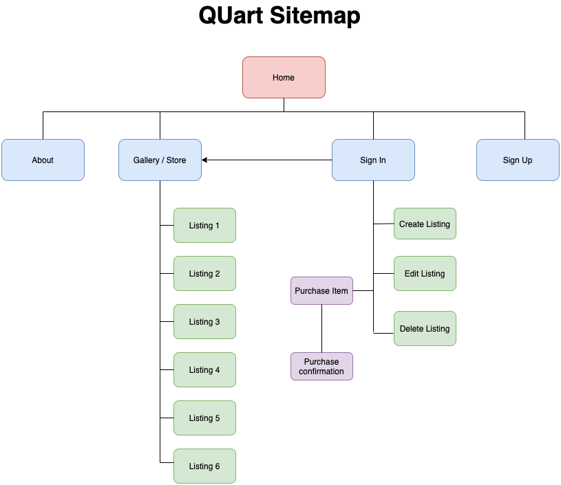
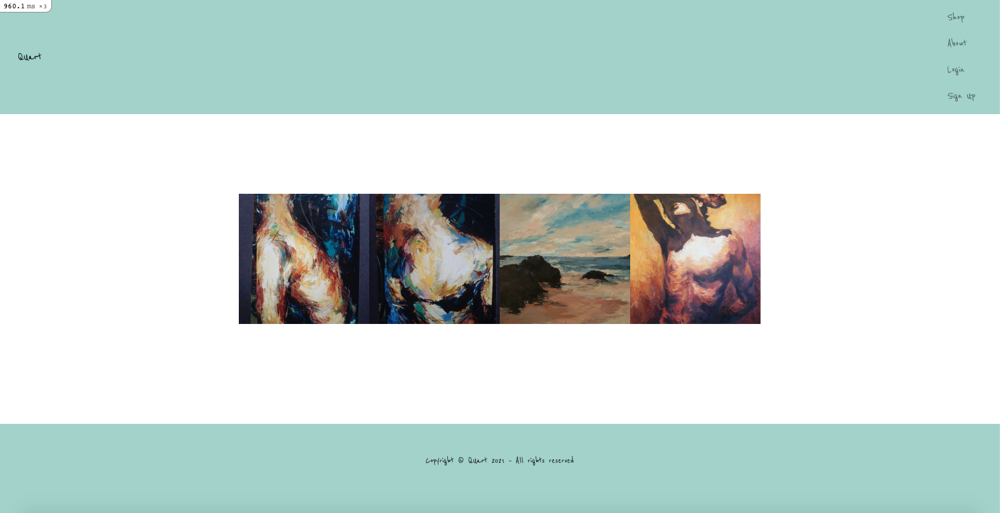
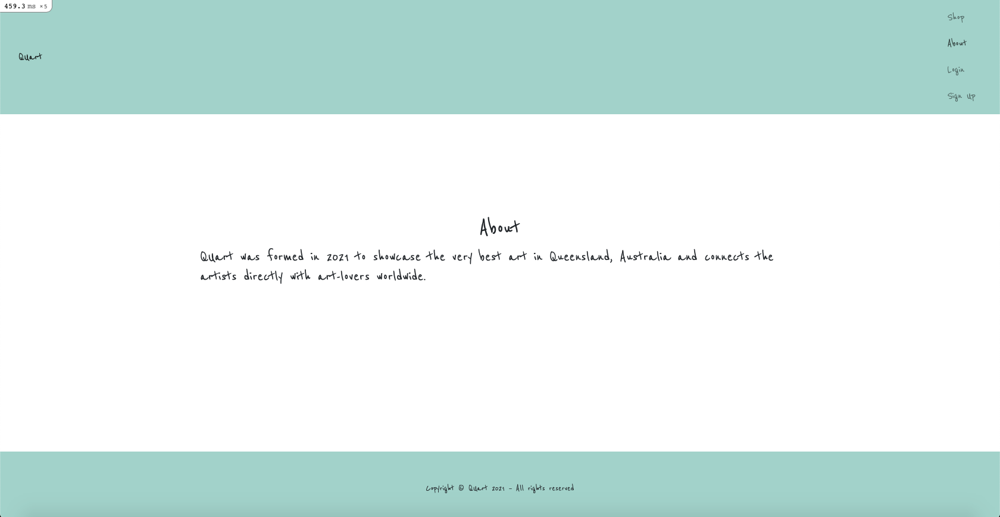
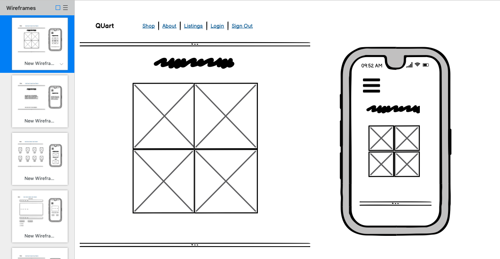
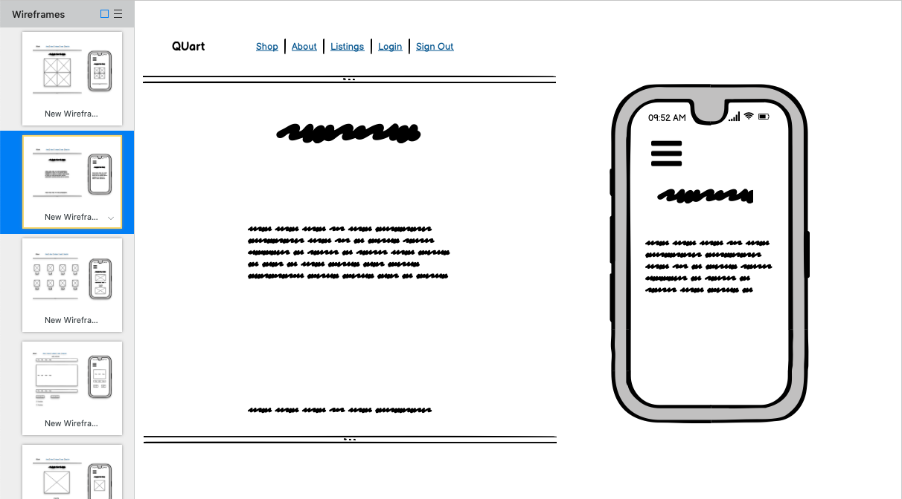
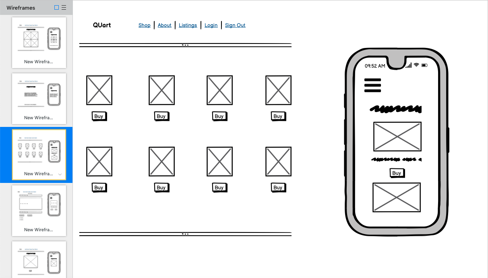
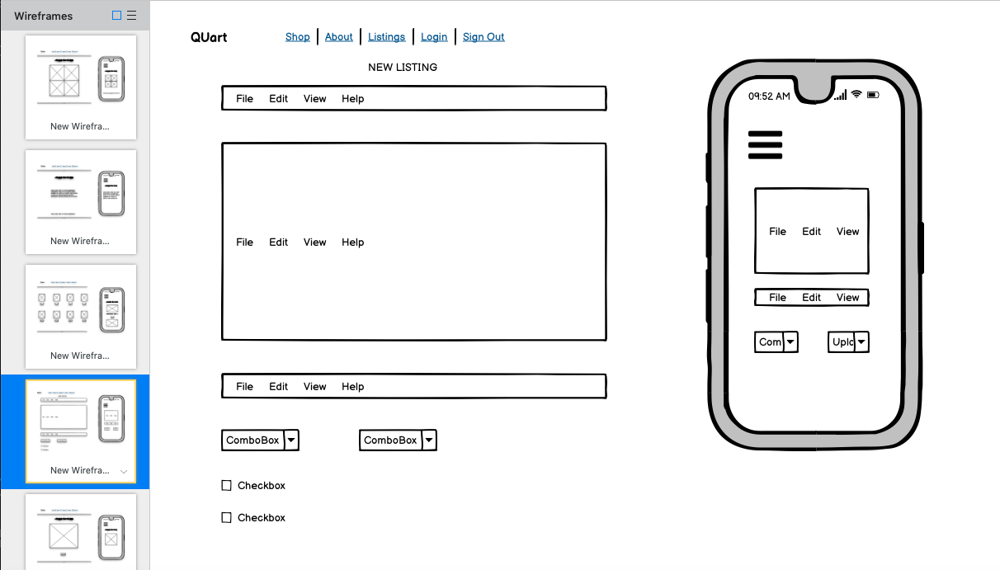
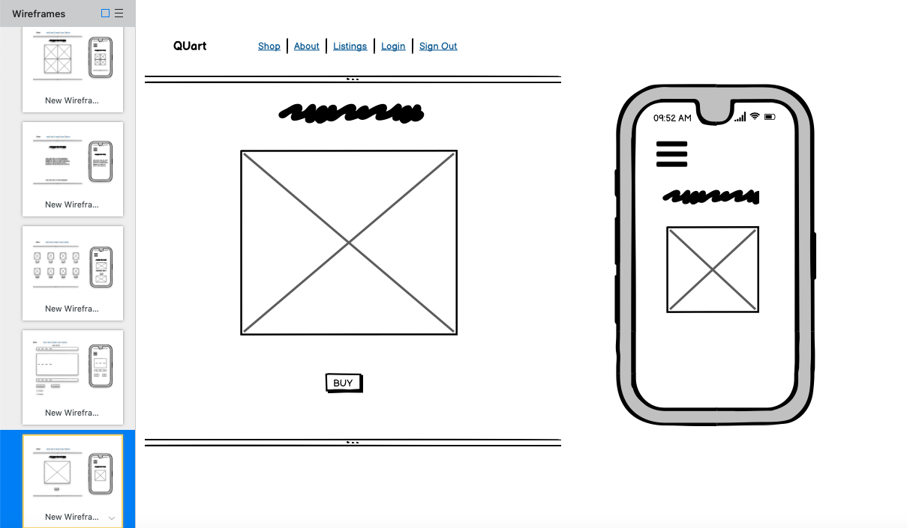
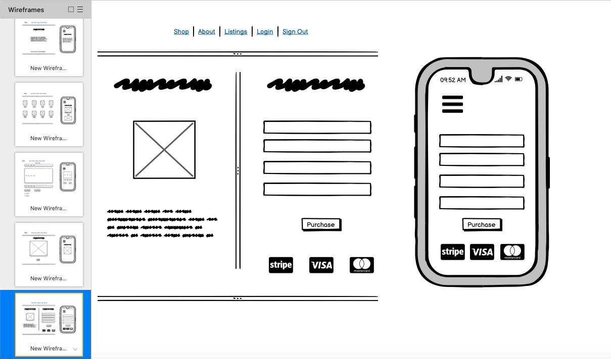
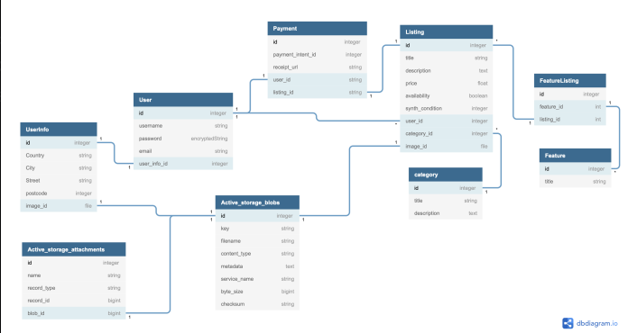

# QUart - T2A2 Marketplace Application - Alastair Blackwood

## Set up instructions for local server

 

1.  Clone this repo.

    https://github.com/alastairblackwood/T2A2_QUart

 

2.  Run bundle install to install all gems.

        bundle install

 

3.  Rake db:setup to create local database migrate and seed.

        rake db:setup
        rake db:migrate
        rake db:seed

 

4.  Enter Stripe credentials.

    https://stripe.com/eu-au

 

5.  Run the rails server.

        rails s

 

6.  Load http://localhost:3000/ in the browser.

 

# R7 - Identification of the problem you are trying to solve by building this particular marketplace app.

Purchasing and enjoying art is a deeply personal human activity, often tied to an individual’s unique journey or experience. It can embody and express someone’s own emotions of love, joy, delight, connection and wonder in a way they may be unable to do on their own. Appreciation for the artist themselves, their personal style and ability, and connection to the art they produce, often comes hand-in-hand.

While there are a small number of online art marketplaces that exist to purchase art online in Australia, such as Bluethumb, Artfinder and Art Lovers, they often cast a wide net of areas and demographics which, in turn, can make the experience a little too ‘noisy’, dislocating and impersonal. For my marketplace app, I wanted to create something that helps to reduce some of that noise, tightens the focus down to a smaller group of high quality artists in one state (Queensland) and facilitates a more personal journey and direct connection between Queensland artists and local art-lovers.

 

# R8 - Why is it a problem that needs solving?

Because there is such a large volume of competition between artists to gain exposure so that their work is seen by the general public, it is easy for an artist to get lost in the ‘one-size catch-all’ art marketplaces currently on offer. By reducing the focus down to one geographic area of Australia instead, I hope that this will make it easier for a customer to find an artist’s work. Also, by creating a platform where the customer can purchase directly from the artist and know they will receive 98% of that income (vs the much higher fees associated elsewhere) helps the customer know they are truly supporting the artist in the best way possible.

 

# R9 - A link (URL) to your deployed app (i.e. website)

https://guarded-fortress-44138.herokuapp.com

 

# R10 - A link to your GitHub repository - ensure the repo is accessible by your Educators

https://github.com/alastairblackwood/T2A2_QUart

 

# R11 - Description of your marketplace app (website), including: purpose, functionality / features, sitemap, screenshots, target audience, tech stack (e.g. html, css, deployment platform etc).

The purpose of my marketplace website is to act as an engagement and payment interface between Queensland artists and art-lovers.
It opens on to a clean-looking homepage with links to the gallery / shop, login and sign-up pages.
Once a user signs up, they can create a listing with the edit and delete functionality fixed to that user alone. A different user who signs up can then purchase anything in the listing/shop using the Stripe payment system.
The target audience for the app is primarily geared towards people living in Queensland who love high quality art and want to own something unique while supporting and connecting with local artists themselves. They will be both male and female, primarily in the 25-65 age bracket, with medium to high incomes.

The tech stack I have used for the app incorporates HTML, CSS & SASS, Ruby on Rails (utilising Devise, jQuery3, Rspec, Bootstrap, Stripe, Simple Form gems and Amazon AWS service). The app was deployed using the platform Heroku.

 

Sitemap

 

Homepage

 

About

# R12 - User stories for your app

1. As an experienced fine-artist based in Brisbane, I want a well-designed online platform where I can easily showcase my art, not get lost among thousands of other sellers and not have a middle-man take a 50% cut of the sale at the end.

2. As a First Nations artist based in Cairns, I would like a website that connects me directly to potential buyers all over the world who I can easily engage with and slowly begin to build my brand.

3. As a passionate Sydney art collector who struggles to visit galleries due to the recent pandemic, I want a platform that filters good quality art from the bad and displays them in an online gallery that gets me as close to the real thing as possible. I also want to “get to know” the artists and see their stories displayed in an engaging way.

4. As a proud Queenslander who lives on the Gold Coast, occasionally buying art and crafts at local markets, I would like to see a website that focuses on artists here in Queensland and makes me feel like I’m able to support the individual directly. I want to know most of my money is going to the artist and not to some other entity/gallery owner.

 

# R13 - Wireframes for your app

Homepage

 

About page

 

Gallery / Shop page

 

Create Listings page

 

Select / purchase listing page

 

Checkout / Stripe page

 

# R14 - An ERD (Entity Relationship Diagram for your app)

 

Initial ERB

Final ERB

 

# R15 - Explain the different high-level components (abstractions) in your app

My application is structured using the Rails MVC architecture. My models contain the database and relationships between entities, in my case, how the user is connected to the art listings they create, how they are structured (i.e. one to many or many to many) and how they belong to other attributes such as features, categories etc.

The controller is the brain of my application and sits between the models and the views. The controller filters the information I want to display depending on the code written, pulling the content stored in my database and models and outputting that to the views. The controller is primarily how I’m able to create a two-sided marketplace by defining methods such as ‘set_user_listing’ which restricts what users not linked to a listing can see or do to it when logged in.

The views are the final part of the process and are what is displayed to the viewer. It primarily contains the html and embedded ruby elements that are then styled through CSS and brought to life via JavaScript.

 

# R16 - Detail any third party services that your app will use.

I have used three third-party services for my application. The first one is Amazon AWS S3, which functions as an online storage folder that can retrieve any amount of data, any time and place on the internet. It’s scalable, fast and reliable and considering the overall benefits it offers, relatively cheap to use. I have used it to store my users/artists images so that it puts less pressure on Heroku’s deployment network.

The second third-party service I used was Stripe - the payment system used to facilitate safe and secure card payments online. Stripe removes the financial complexity of running a business by working with the financial institutions, payment networks, banks, consumer wallets directly etc. All the user has to do is sign up for an account and install the code and they’re up and running.

To deploy the website, I used the third-party container-based cloud platform ‘Heroku’. It’s simple and easy to use (once you’re able to upload your site) and removes a lot of the hassle that can be associated with site deployment so that you can focus on spending most of your time developing/coding projects.

 

# R17 - Describe your projects models in terms of the relationships (active record associations) they have with each other.

 

# R18 - Discuss the database relations to be implemented in your application.

 

# R19 - Provide your database schema design

 

# R20 - Describe the way tasks are allocated and tracked in your project.

https://trello.com/invite/b/SFpYTiGl/64098aca2a76f642cdca3f42726e2149/quart-t2a2-marketplace-app
